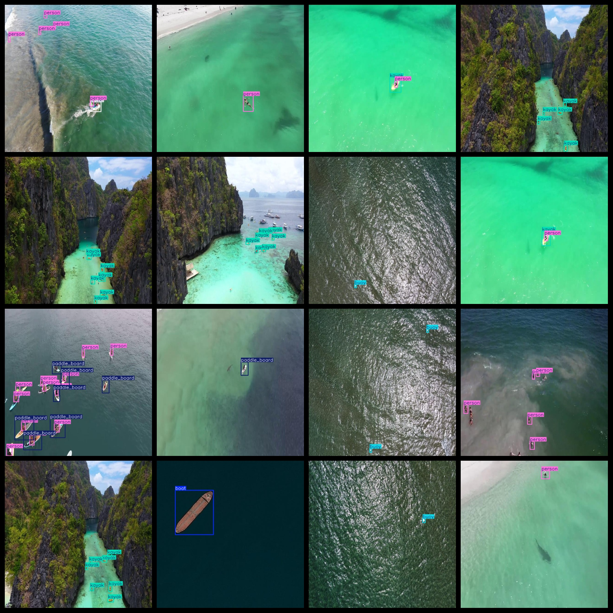
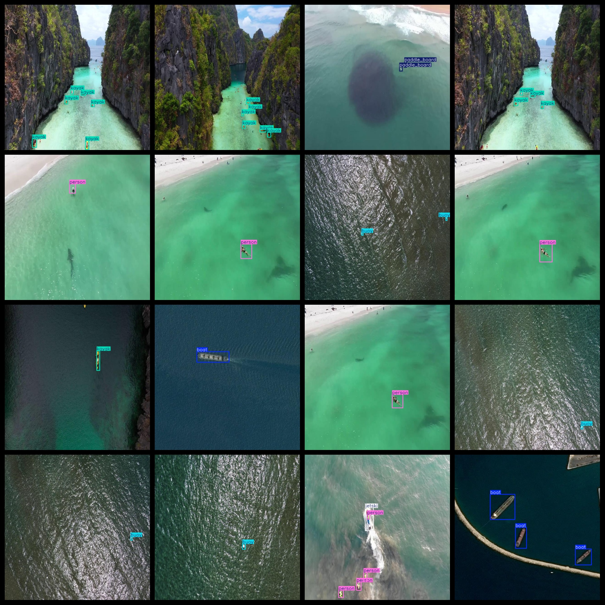
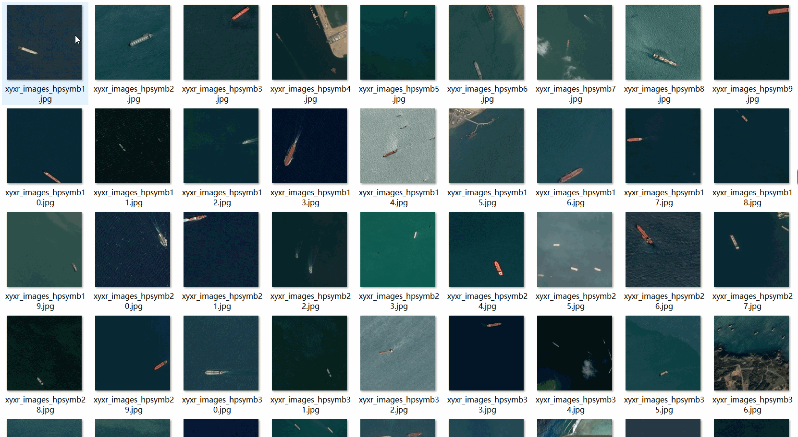

# UAV Aerial Water Domain Target Detection Dataset 7746 imagesVOC+YOLO

The UAV Aerial Water Domain Target Detection Dataset consists of 7746 images in both the VOC and YOLO formats. The dataset is organized into three folders: JPEGImages, Annotations, and labels. The JPEGImages folder contains a total of 7746 JPEG images, while the Annotations folder contains an equal number of XML files. The labels folder contains a total of 7746 txt files. The dataset includes 6 types of labels: "boat", "buoy", "jetski", "kayak", "paddle_board", and "person". Each label has its own set of bounding box numbers, which are listed in the labels folder's classes.txt file.

The boat label has 1853 bounding boxes, the buoy label has 1635 bounding boxes, the jetski label has 63 bounding boxes, the kayak label has 9871 bounding boxes, the paddle board label has 5405 bounding boxes, and the person label has 8961 bounding boxes. The total number of bounding boxes across all labels is 27788.

The images are of high resolution clarity, and have not been enhanced. The labels are rectangular boxes that are used for target detection recognition.

This dataset does not guarantee the accuracy or precision of any trained models or weight files, but it provides accurate and reasonable annotations.

Note: There are no special disclaimers here; this dataset is provided without any guarantees regarding the accuracy or precision of the models trained with it.

## Images

---

Here is a pay link on Stripe (https://buy.stripe.com/3cs8yP7sY87d0vu9AB). Please contact me lonlonago@foxmail.com after funding $89, and I will send you a complete data files, thank you!

